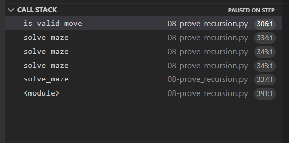

# Stacks

Stacks are a type of data structure. You use a list of items and when you have them in a stack it's functionality is `"Last in, first out" or LIFO.` We use stacks all the time, even if we don't realize it. Think about a web browser page. Lets say you clicked on a link that took you to a page you actally arent interested in but there was more on the previous page you wanted to explore. What do you do? You click on the back button to return to the previous page. A web browser always saves a stack of the web links visited in order so you can naviage back to a previous page. This is a simple example of `LIFO.` 

A stack in python is pretty simple to work with. To create a stack use square brackets, like this:

```python
stack = []
```
Remember, you don't have to use the word "stack". Any variable will work.

To add an item to the stack you use the append operation, like this:

```python
stack.append(item)
```
The item can be any number or string. This will add the item to the end of the stack.

To retrieve the last item in the stack you use the pop operation, like this:

```python
stack.pop()
```
This will return the last item in the list. Remember, `last in, first out.`


## Why Stacks are Useful

Like I mentioned before, Stacks are extremely helpful for programmers or anyone who uses a computer. Having a "undo" button, and trusting it will go back to the previous step, is very useful.

When you write a program (in any programming language) there are functions you call that call other functions, etc. This is always kept track of with a stack. You can see the stack in your editor when you debug a program. Look for the "CALL STACK" box and you will see the stack that your program is creating.




Using append() and pop() on a stack results in O(1) time. Not the fastest, but not slow either.


Here are some examples of how you could initialize a stack in a python program and some useful functions:

```python
"""
Stack Data Structure.
"""
class Stack():
    def __init__(self):
        self.items = []

    def push(self, item):
        self.items.append(item)				

    def pop(self):
        return self.items.pop()
    
    def is_empty(self):
        return self.items == []
    
    def peek(self):
        if not self.is_empty():
            return self.items[-1]
        
    def get_stack(self):
        return self.items

myStack = Stack()
myStack.push("A")
myStack.push("B")
myStack.push("C")
myStack.push("D")
print(myStack.peek())
```


## Common Errors

When using a stack structure here is a common error to avoid:

Lets say you've been asked to create a program that will search through a given string and remove any duplicate letters next to eachother. You begin by creating a new empty stack called stack_1. You use a for loop to search through each letter in the string to find duplicates. If it's a duplicate letter right next to eachother then you use the pop() operation to remove it from the stack. If it is not a duplicate you use the append() opperation to add it to the stack. 

One thing that programmers often forget to do is to check if the srting given is empty. If you run the program with an empty string you will get an error. The first line inside the for loop says 'if stack_1'. This is checking if the string is empty.

```Python
def duplicates(first):
    stack_1 = []
    for i in first:
        if stack_1 and i==stack_1[-1]:
            stack_1.pop()
        else:
            stack_1.append(i)
    return "".join(stack_1)

# test case 
first = "abbcdeefggh"
print(duplicates(first))
```


## Example : Bad to Good Program

In the example below, we will write a simple program that changes the word 'bad' into the word 'good' from a given string. This program uses a stack.

- Allow the user to type any sentance they want using the word 'bad'
- Replace the word 'bad' with 'good'
- Display the new sentance

```python
def bad_to_good(text):
    stack = []
    for item in text.split(' '):
        if item == 'bad':
            stack.append('good')
        else:
            stack.append(item)
    s = ' '
    return s.join(stack)

print("Welcome to 'Bad to Good'")
text = input("Type a sentance with the word 'bad' used several times to create a bad senario:")

print(bad_to_good(text))
```

The program first creates an empty stack. Then it goes through each word in the inputted sentance and checks if the word is 'bad'. If it is it appends the word 'good' in it's place. If the word is not 'bad', it appends the original word to the stack. Then we join the words back together to display the revised sentance. Here is an example of the program in action:


**_______________________________________________________________________________________**


## Problem to Solve : Remove The Numbers

Write a program that will find and remove all numbers in a given string using a stack.

You can test your program with the following scenarios:

- Test 1: Enter abcdefghij12345678klmnopqrstuvwxyz   -You should get the alphabet without any numbers back.
- Test 2: Enter I went to the 54321 grocery store    -You should get the sentance without 54321 back.
- Test 3: Enter 123456789applegrapestrawberrypeach   -You should get the fruit with no numbers back.
- Test 4: Enter 1a2b3c                               -You should get abc back.

You can check your code with the solution here: [Solution](remove_numbers.py)


[Back to Welcome Page](0-welcome.md)


